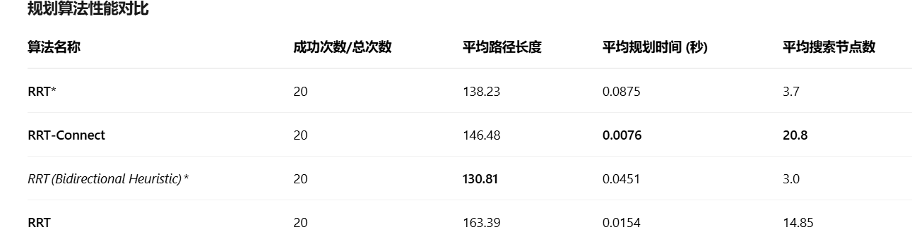
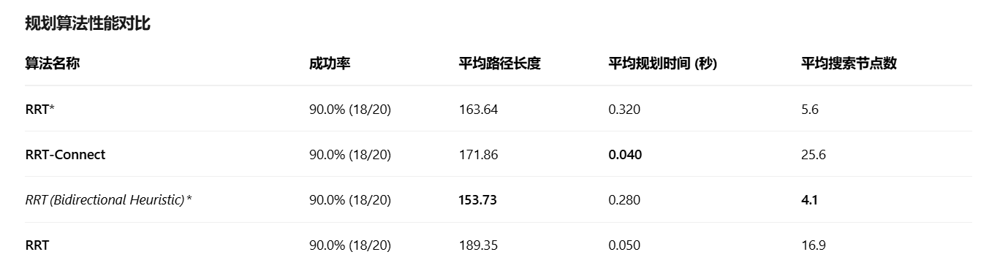

# rrt及简易bench开发
Collection of rrt-based algorithms that scale to n-dimensions:
- rrt
- rrt* (rrt-star)
- rrt* (bidirectional)
- rrt* (bidriectional, lazy shortening)
- rrt connect

Utilizes [R-trees](https://en.wikipedia.org/wiki/R-tree) to improve performance by avoiding point-wise collision-checking and distance-checking.

This would not have been possible without Steven M. LaValle's excellent [Planning Algorithms](https://lavalle.pl/planning/) book, specifically [Chapter 5, Section 5: Sampling-Based Motion Planning, Rapidly Exploring Dense Trees](https://lavalle.pl/planning/node230.html).

## Requirements
- [Python 3+](https://www.python.org/downloads/)
- [NumPy](http://www.numpy.org/)
- [Rtree](https://pypi.python.org/pypi/Rtree/)
- [Plotly](https://plot.ly/python/getting-started/) (only needed for plotting)

## Usage
Define an n-dimensional Search Space, and n-dimensional obstacles within that space. Assign start and goal locations as well as the number of iterations to expand the tree before testing for connectivity with the goal, and the max number of overall iterations.

### Search Space
Assign bounds to Search Space in form: `[(x_lower, x_upper), (y_lower, y_upper), ...]`

### Start and Goal
Points represented by tuples of form: `(x, y, ...)`

### Obstacles
Axis-aligned (hyper)rectangles represented by a tuples of form `(x_lower, y_lower, ..., x_upper, y_upper, ...)`

Non-axis aligned (hyper)rectangles or other obstacle representations should also work, provided that `collision_free` and `obstacle_free` are updated to work with the new obstacles.

### Resolution
Assign resolution of edges:
- `q`: Distance away from existing vertices to probe.
- `r`: Discretization length to use for edges when sampling along them to check for collisions. Higher numbers run faster, but may lead to undetected collisions.

### Examples
Visualization examples can be found for rrt and rrt* in both 2 and 3 dimensions.
- [2D RRT](https://plot.ly/~szanlongo/79/plot/)
- [3D RRT](https://plot.ly/~szanlongo/81/plot/)
- [2D RRT*](https://plot.ly/~szanlongo/83/plot/)
- [3D RRT*](https://plot.ly/~szanlongo/89/plot/)
- [2D Bidirectional RRT*](https://plot.ly/~szanlongo/85/plot/)
- [3D Bidirectional RRT*](https://plot.ly/~szanlongo/87/plot/)
- [2D Heuristic Bidirectional RRT*](https://plot.ly/~szanlongo/91/plot/)
- [3D Heuristic Bidirectional RRT*](https://plot.ly/~szanlongo/93/plot/)


## 补充->简易benchmark集成设计

在使用bench前需要先安装rrt包

```bash
pip install -e .
```

评测文件路径在.**/examples/rrt_star/rrt_star_3d_with_random_obstacles_eval_bench.py**。该任务随机设计障碍物，起点和终点，评测从起点到终点的路径规划效果。在其中对于node（转折点的数目），路径长度，花费时间和成功率进行了测评，对包括RRT star,RRTConnect,RRTStarBidirectionalHeuristic,RRT在设置评测次数为20次的时候得到结果如下：



可见在四种RRT算法中，RRT Bid获得的效果最好。

此外还设计了第二个任务，即多段路径规划，即先规划A->B,再规划B->C。该文件路径在：.**/examples/rrt_star/multi_point_eval_bench.py**

用来模拟无人机先取货再送货的过程。一共要规划两次，评估其结果：



可见，依旧是RRT Bid的效果最好（但是其时间花费相对较长）
